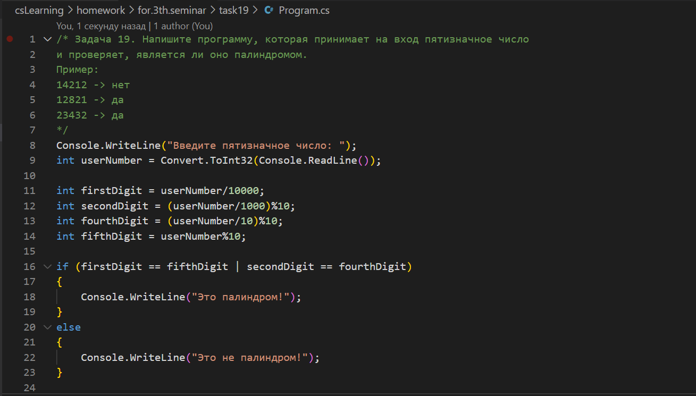
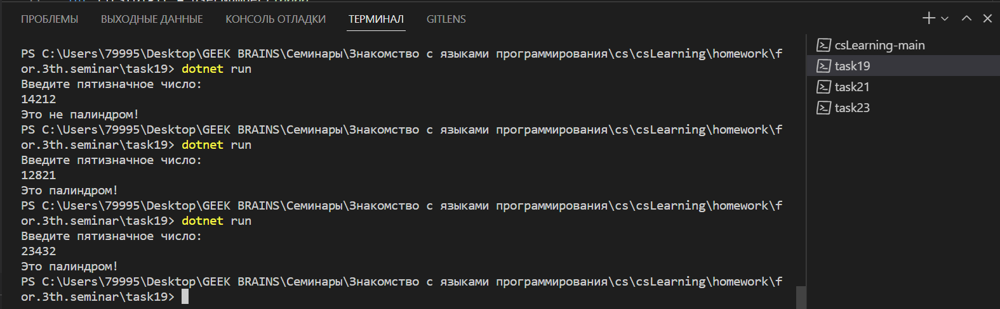
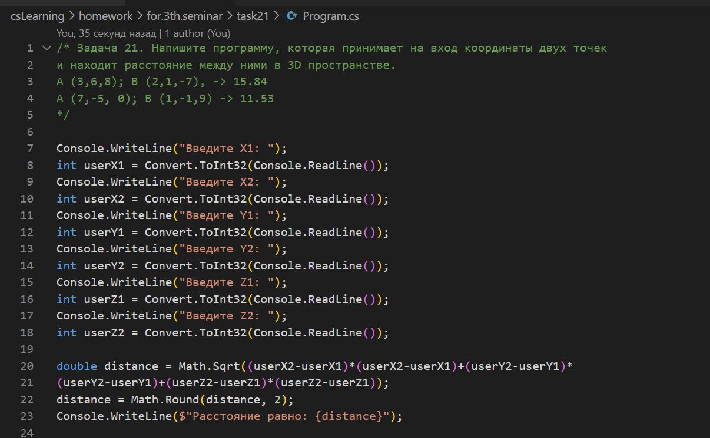
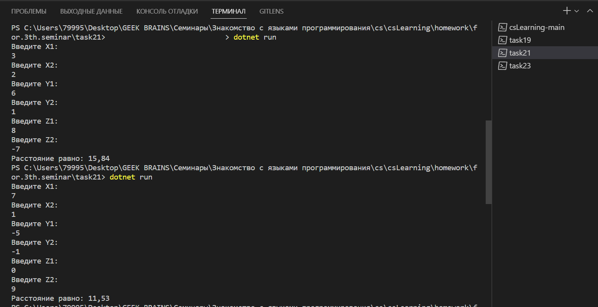
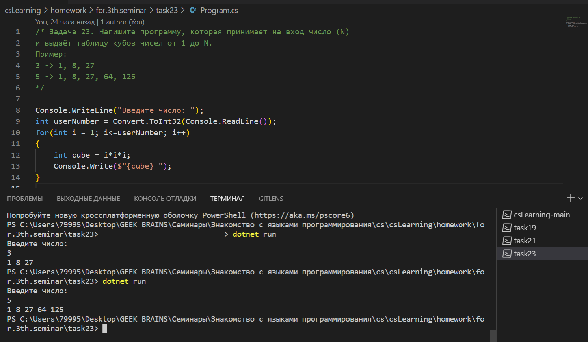

# Домашняя работа к семинару №3 #
## ***Задача 19*** ##
Напишите программу, которая принимает на вход пятизначное число и проверяет, является ли оно палиндромом.

Пример:

14212 -> нет

12821 -> да

23432 -> да

## ***Задача 21*** ##
Напишите программу, которая принимает на вход координаты двух точек и находит расстояние между ними в 3D пространстве.

Пример:

A (3,6,8); B (2,1,-7), -> 15.84

A (7,-5, 0); B (1,-1,9) -> 11.53

## ***Задача 23*** ##
Напишите программу, которая принимает на вход число (N) и выдаёт таблицу кубов чисел от 1 до N.

Пример:

3 -> 1, 8, 27

5 -> 1, 8, 27, 64, 125 

